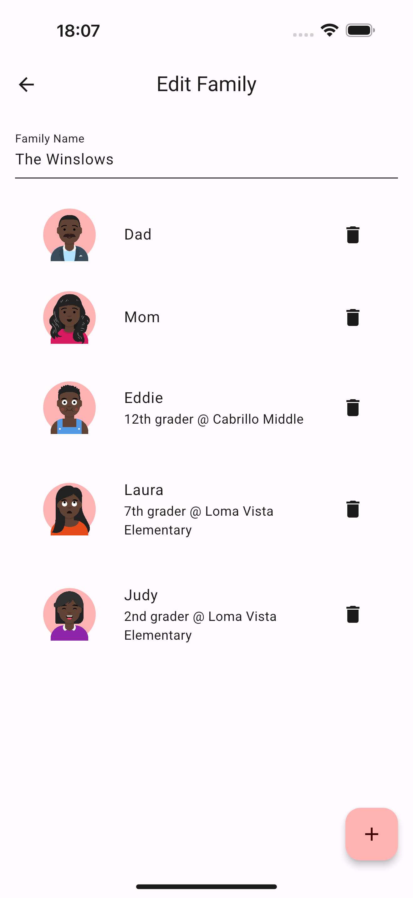
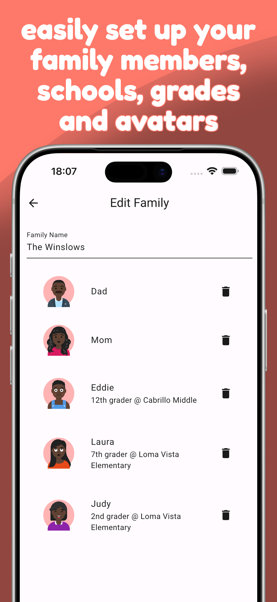

# Publish to stores action

This action will publish your app to the Google Play Store and the Apple App Store:

- app itself: AAB for Android, and IPA for iOS
- screenshots: must be provided along with text to be re-framed into a device mockup

It is similar to Fastlane, though MUCH simpler.

## Screenshots

You typically need to generate golden screenshots from `widget_test.dart` and save their descriptive text before invoking this action.

This is the assumed structure in your app repository:

```
metadata/
└── en-US
    └── images
        ├── 0-week.txt
        ├── 1-weekend.txt
        ├── 2-chores.txt
        ├── 3-family.txt
        ├── ipadLandscapeScreenshots
        │   ├── 0-week.png
        │   └── 3-family.png
        ├── ipadScreenshots
        │   ├── 0-week.png
        │   └── 3-family.png
        ├── iphoneScreenshots
        │   ├── 0-week.png
        │   ├── 1-weekend.png
        │   ├── 2-chores.png
        │   └── 3-family.png
        ├── macbookScreenshots
        │   ├── 0-week.png
        │   └── 3-family.png
        └── phoneScreenshots
            ├── 0-week.png
            ├── 1-weekend.png
            ├── 2-chores.png
            └── 3-family.png
```

The text will be added on top of the device frame, according to what is inside the `assets/*.png` folder in this action repository.  
Example text:

```
$ cat metadata/en-US/images/3-family.txt
easily set up your family members, schools, grades and avatars
```

This will convert the screenshot into a device frame with the text inserted on top, with the font in the `assets/*.ttf` folder of that action repository:




This action will also build a `metadata/index.html` page with the screenshots displayed in a table.  
You can then add the `metadata/` folder as an artifact to be saved/archived, or you can push this to an HTTP server to review what the screenshots look like.

## Configuration

The stores API credentials must be saved to disk before execution. Typically store them encrypted with `git-crypt`, or save them to a file from an environment variable.

This example assumes:

```
.secure_files/
├── AuthKey_APPLTEAMID.p8
└── utility-123456-aabbccddeeff.json
```

Workflow configuration:

```yaml
name: Flutter CI/CD

jobs:
  production:
    runs-on: flutter
    if: "startsWith(github.ref, 'refs/tags/')"
    steps:

...

      - name: Deploy on stores
        uses: BenoitDuffez/store-upload-action@master
        with:
          google_service_account_path: .secure_files/projectname-123456-aabbccddeeff.json
          apple_key_id: APPLTEAMID
          apple_p8_folder: .secure_files
          apple_issuer_id: 00000000-0000-0000-0000-000000000000

...
```

The `google_service_account_path` will be read directly, and the Apple `p8` file should be saved as `${apple_p8_folder}/AuthKey_${apple_key_id}.p8`.  
You can get the issuer ID from the AppStore Connect / developer account.

This will build an AAB/IPA, upload it to the store as a version that matches what is defined in `pubspec.yaml`, upload the screenshots.

## Credits

- iPhone frame: [developer.apple.com](https://developer.apple.com/design/resources/#product-bezels)
- Pixel Frame: [jamesjingyi/mockup-device-frames](https://github.com/jamesjingyi/mockup-device-frames/blob/main/Exports/Android%20Phone/Pixel%209%20Pro%20XL/Pixel%209%20Pro%20XL%20Obsidian.png)
- Font: [hafontia/Fredoka-OneFont](https://github.com/hafontia/Fredoka-One)
